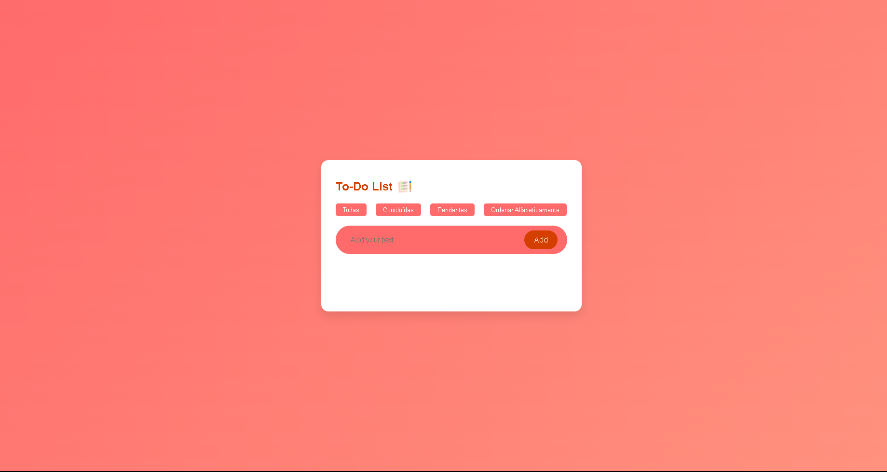

# To-Do List Application

This is a user-friendly tool designed to help users manage their daily tasks efficiently. The application is built using Electron, HTML, CSS, and JavaScript. It offers features such as adding tasks with timestamps, marking tasks as completed, and deleting tasks with a simple click.



## Demo

- See a live demo of the To-Do List Application [here](./src/img/screenshots/gif/todolistapp.gif).

## Contents

- [Application Structure](#application-structure)
- [How to Use](#how-to-use)
- [Customization](#customization)
- [License](#license)

## Application Structure

- The application structure is organized as follows:

to-do-list-app/
│
├── src/                  # Main folder
│   ├── img/              # All images
│   │   ├── screenshots/ # Images of the project
│   │   │   └── gif/     # GIFs of the project
│   │
│   ├── js/              
│   │   └── script.js    # Script of the project
│   │
│   ├── style/           
│   │   └── index.css    # Style of the project
│   │
│   └── index.html       # Main body of the project
│
├── .gitignore
└── main.js    

## How to Use

1. Clone this repository to your computer:

   ```bash
   git clone https://github.com/joseook/to-do-list-app.git
   ```

2. Navigate to the project folder:

   ```bash
   cd to-do-list-app
   ```

3. Open the `index.html` file in your web browser to view the To-Do List Application.

## Customization

- You can customize the application in the following ways:

### Content

- Open the `index.html` file and modify the content as needed.
- Add or remove features or sections as desired.

### Styles

- Customize the application's style by editing the `style.css` file. You can change colors, fonts, sizes, and more to suit your requirements.

### Images

- Replace the images in the `img/` folder with your own images. Ensure to keep the file names and update references in the HTML files if necessary.

### Task Management

- The application is set up to manage tasks efficiently. To add more features or modify existing ones, refer to the `script.js` file.

## License

This project is licensed under the MIT License - see the [LICENSE](LICENSE) file for details.

## Notes

This project is for both personal and professional use. Enhance your productivity by managing your tasks efficiently.

--- 
